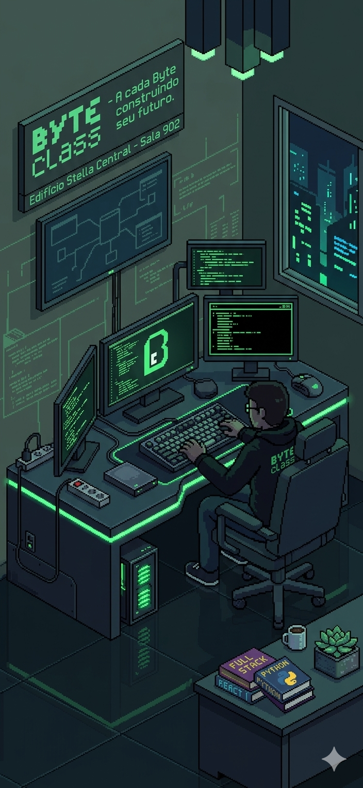

# 🟢 ByteClass 



> "A cada Byte construindo seu futuro."

Bem-vindo ao repositório oficial da aplicação **ByteClass**, o braço educacional do ecossistema de aprendizado de **programação**. 

Esta aplicação é uma Landing Page de alta performance projetada para apresentar nossa formação Full-Stack robusta, localizada na Sala 902 do Edifício Stella Central, em Juiz de Fora - MG.

---

## 🚀 Sobre o Projeto

A ByteClass foca em transformar iniciantes em desenvolvedores seniores através de uma trilha que abrange **27 tecnologias**. O design da aplicação utiliza uma estética **Cyber-Retro**, misturando *Pixel Art* 16-bit com componentes modernos de *Glassmorphism*.

### 💎 Diferenciais da Interface
* **Performance Ultra-Light:** Desenvolvido em Vanilla JS para carregamento instantâneo.
* **Experiência Imersiva:** Iluminação Neon Cyber Green baseada na identidade visual da marca.
* **Arquitetura Orientada a Dados:** Renderização dinâmica de componentes via JSON.
* **Design Responsivo:** Mobile-first adaptado para todos os dispositivos.

---

## 🛠️ Stack Tecnológica

O projeto foi construído utilizando as bases sólidas da web, garantindo baixa latência e SEO otimizado:

* **HTML5:** Estrutura semântica e acessível.
* **CSS3:** Variáveis globais, CSS Grid, Flexbox e efeitos de desfoque (backdrop-filter).
* **JavaScript (ES6+):** Manipulação de DOM e filtragem dinâmica de trilhas.

---

## 🖼️ Guia de Assets Visuais

As imagens do projeto seguem um padrão visual rigoroso criado para a ByteClass:

| Arquivo | Seção | Descrição |
| :--- | :--- | :--- |
| `byteclass_hero.png` | **Hero** | Workstation dev em pixel art com iluminação neon verde. |
| `tech_wall_bg.png` | **Vitrine** | Grid digital com ícones das 27 tecnologias do ecossistema. |
| `jornada_mapa.png` | **Trilhas** | Mapa RPG ilustrando a evolução do aluno até o Full Stack. |
| `aluno_focado.png` | **Comunidade** | Humanização da marca focada na imersão e mentoria. |
| `edificio_stella.png` | **Local** | Visual noturno da sede física no Edifício Stella Central. |
| `byteclass_rocket.png` | **Sucesso** | Badge de conquista simbolizando o lançamento da carreira. |


---

## 🏗️ Panfletos originais

🏛️ Identidade e Localização
Nome da Escola: ByteClass

Slogan Principal: "A cada Byte construindo seu futuro."

Localização Física: Edifício Stella Central - Sala 902. (Juiz de Fora, MG).

Conceito: Uma escola de tecnologia focada em formação prática e mentoria presencial/híbrida.

📚 Estrutura do Curso (Tracks & Níveis)
O curso é dividido em uma progressão lógica para garantir que o aluno saia com nível de Analista Sênior:

1. Níveis de Formação
M1 - Básico: Lógica, Algoritmos e introdução ao ambiente de desenvolvimento.

M2 - Fundamental: Bases sólidas de Web (HTML/CSS) e linguagens estruturadas.

M3 - Intermediário: Frameworks, Integração de APIs e Banco de Dados.

M4 - Avançado: Arquitetura de sistemas, Performance e Segurança.

M5 - Bootcamp: Projetos reais de ponta a ponta (Full-Stack) focados em portfólio.

2. Trilhas Técnicas (Stacks)
Frontend: Foco em interface, interatividade e experiência do usuário (React, Vue, Tailwind).

Backend: Foco em servidores, lógica de negócio e persistência (Node, PHP/Laravel, Python).

Fullstack: Domínio completo de ambas as pontas.

🛠️ O Stack Tecnológico (As 27 Tecnologias)
Baseado no "Tech Wall" dos panfletos, as tecnologias que precisamos listar no main.js são:

Linguagens/Runtimes: JavaScript, Node.js, PHP, Python, SQL.

Frontend & Frameworks: ReactJS, Vue 3, Next.js, HTML5, CSS3, Tailwind CSS, Sass.

Backend & Frameworks: Laravel (PHP), Express (Node), Django (Python).

Mobile: React Native, Expo.

Ferramentas & Infra: Git, GitHub, Docker, Vercel, Supabase, MySQL, PostgreSQL.

Design/UX: Figma, Glassmorphism, UI/UX Design.

🎯 Proposta de Valor (Marketing)
Os panfletos destacam três pilares que devem estar no nosso HTML:

Aceleração de Carreira: "Não apenas aprenda a codar, aprenda a ser um profissional disputado."

Mentoria Real: Mentoria com quem vive o mercado (Douglas Novato, CTO).

Networking: Localizada em um Hub de tecnologia (Edifício Stella), facilitando conexões.

📝 Textos para o Site (Copywriting)
Headline (Hero): > "A cada Byte construindo seu futuro. Sua jornada para se tornar um desenvolvedor sênior começa na Sala 902."

Chamada para Ação (CTA): > "Transforme sua curiosidade em profissão. Inscrições abertas para a próxima turma em Juiz de Fora."

Destaque de Localização: > "Venha tomar um café conosco no Edifício Stella Central. Ambiente preparado para foco total e alta performance."


---

## 🏗️ Estrutura de Arquivos

```bash
Cursos-Tech/
├── assets/             # Imagens e ícones otimizados (.webp)
├── css/
│   └── style.css       # Design System e Glassmorphism
├── js/
│   └── main.js        # Lógica de renderização e filtros
├── index.html          # Ponto de entrada da aplicação
└── README.md           # Documentação do projeto
```